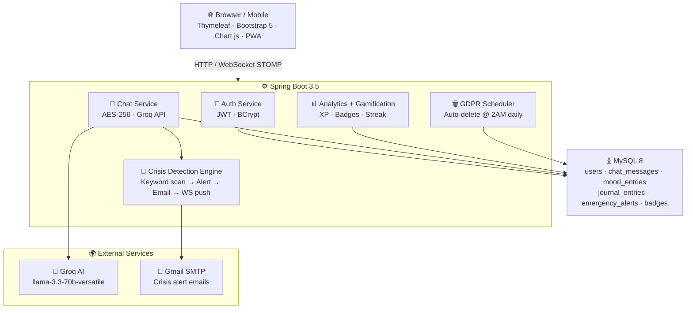

<div align="center">

# 🧠 Mind Companion

### *Your AI-powered mental wellness companion — always available, always listening.*

<br/>


<br/>

> **Built from scratch. No shortcuts. No templates.**
> A production-grade full-stack application that takes mental health seriously — and shows it in every line of code.

<br/>

[Features](#-features) · [Tech Stack](#-tech-stack) · [Getting Started](#-getting-started) · [API Reference](#-api-reference) · [Security](#-security)

</div>

---

## 💡 Why This Exists

Mental health is one of the most underserved areas in technology. Millions of people struggle silently every day — not because they don't want help, but because help isn't always accessible. Therapy is expensive, stigma is real, and reaching out to someone at 2 AM when you're at your lowest isn't always possible.

Mind Companion was built around a simple idea: **what if support was always available?**

Not as a replacement for professional therapy — Serenity is clear about that — but as a safe space where someone can express how they're feeling without judgment, track their emotional patterns over time, and know that if they're ever in crisis, someone will be notified.

A few specific problems this project addresses:

**Accessibility.** Most mental health apps are paywalled or require professional involvement to get started. Mind Companion requires nothing except signing up.

**Privacy.** Conversations about mental health are deeply personal. Every message is encrypted with AES-256 before being stored. Users can enable confidential mode so nothing is saved at all. Data retention is configurable and fully deletable under GDPR.

**Crisis response.** Existing chat apps don't act on what you say. Mind Companion does — if crisis language is detected, an emergency contact is notified immediately, without the user having to ask for help or even be aware it happened.

**Continuity.** A journal, a mood log, a streak counter, badges — these aren't just features. They're ways of showing someone that their progress matters and that showing up consistently, even when it's hard, is worth something.

This project was also a deliberate technical challenge: building a production-grade Spring Boot application with real security (JWT, AES-256, WebSocket auth), real-time communication, AI integration, scheduled jobs, PDF generation, and a PWA — all from scratch, without shortcuts.

The result is an application that takes both the human problem and the engineering problem seriously.

- 🔐 **Every message is AES-256 encrypted** before touching the database. Your conversations are private — cryptographically.
- 🚨 **Crisis detection runs on every message.** If distress language is detected, an emergency contact is notified *automatically* — even if the user never asks for help.
- 🗑️ **GDPR-compliant by design.** Users control exactly how long their data lives, and can erase everything in one API call.
- 📴 **Confidential mode** means messages can be processed and responded to without ever being stored. Zero trace.
- 📱 **Installable as a PWA.** Works offline. Works on mobile. Works everywhere.

This project was also a deliberate engineering challenge — building something that handles security, real-time communication, AI integration, scheduled jobs, PDF generation, and a full frontend without reaching for shortcuts.

---

## ✨ Features

<table>
<tr>
<td width="50%">

### 🤖 Chat with Serenity
Real-time AI conversations powered by **Groq's llama-3.3-70b-versatile**. Serenity uses CBT and mindfulness-based techniques, remembers your last 20 messages for context, and responds like a companion — not a search engine.

- WebSocket (STOMP + SockJS) for zero-latency chat
- REST fallback for non-WebSocket clients
- AES-256 CBC encryption on every stored message
- **Confidential mode** — chat without leaving a trace

</td>
<td width="50%">

### 🚨 Crisis Detection & Alerts
The feature that makes this more than just a chatbot. Every single message is scanned for crisis signals in real time.

- 12 crisis keyword patterns monitored
- Auto-saves `EmergencyAlert` to database
- HTML crisis email dispatched to emergency contact via Gmail SMTP
- WebSocket push to `/queue/crisis` for instant UI alert
- Zero user action required — the system acts on its own

</td>
</tr>
<tr>
<td width="50%">

### 📊 Analytics Dashboard
Not just charts — genuine insight into emotional patterns over time.

- Sentiment breakdown: POSITIVE / NEGATIVE / NEUTRAL / CRISIS
- 30-day mood timeline rendered with Chart.js
- Session stats: total messages, crisis count, positive rate, avg intensity
- **PDF wellness report** generated with Apache PDFBox 3.0.2

</td>
<td width="50%">

### 🏆 Gamification
Because showing up consistently is hard, and it deserves recognition.

- XP points for every chat, mood check-in, and journal entry
- 10-level progression system (Newcomer → Serenity Master)
- Current and longest streak tracking
- Automatic badge awarding with unlock conditions

</td>
</tr>
<tr>
<td width="50%">

### 😊 Mood Tracking
Daily emotional check-ins that build into a long-term picture of your mental wellness.

- 1–10 mood scale with enum-based mood levels
- 7-day and 30-day average calculations
- Full history with Chart.js timeline visualization

</td>
<td width="50%">

### 🔒 GDPR & Privacy
Privacy isn't an afterthought here. It's load-bearing.

- Per-user configurable data retention (default 365 days)
- Scheduled auto-delete job runs every night at 2:00 AM
- One-call full data erasure (`DELETE /api/user/data`)
- Complete account deletion with cascading cleanup
- Confidential mode: process without persisting

</td>
</tr>
</table>

---

## 🛠 Tech Stack

| Layer | Technology | Why |
|-------|-----------|-----|
| Language | **Java 21** | Virtual threads, records, modern APIs |
| Framework | **Spring Boot 3.5.14** | Production-grade, battle-tested |
| Security | **Spring Security + JWT (jjwt 0.12.6)** | Stateless, scalable auth |
| Real-time | **Spring WebSocket (STOMP + SockJS)** | True bidirectional communication |
| Database | **MySQL 8 + Spring Data JPA + Hibernate 6** | Reliable, relational, proven |
| AI | **Groq API (llama-3.3-70b-versatile) via OkHttp** | Fastest LLM inference available |
| Encryption | **AES-256 CBC** | Military-grade message encryption |
| Email | **JavaMail (Gmail SMTP)** | HTML crisis alerts |
| PDF | **Apache PDFBox 3.0.2** | Wellness report generation |
| Frontend | **Thymeleaf + Bootstrap 5.3 + Chart.js 4.4** | Clean, responsive, no JS framework overhead |
| Build | **Maven + Lombok 1.18.32** | Fast builds, zero boilerplate |
| CI/CD | **GitHub Actions** | Auto-build and artifact upload on every push |
| Container | **Docker (eclipse-temurin:21-jre-alpine)** | Lightweight, portable, production-ready |

---

## 🏗 Architecture



---

## 🚀 Getting Started

### Prerequisites

- Java 21+
- Maven 3.8+
- MySQL 8
- [Groq API key](https://console.groq.com) (free)
- Gmail account with [App Password](https://myaccount.google.com/apppasswords)

### 1. Clone

```bash
git clone https://github.com/harsshittabhati/mind-companion.git
cd mind-companion
```

### 2. Create MySQL database

```sql
CREATE DATABASE mind_companion_db;
CREATE USER 'mindapp'@'localhost' IDENTIFIED BY 'MindApp@2024';
GRANT ALL PRIVILEGES ON mind_companion_db.* TO 'mindapp'@'localhost';
FLUSH PRIVILEGES;
```

### 3. Set environment variables

```powershell
# Windows PowerShell
$env:GROQ_API_KEY="gsk_your_key_here"
$env:GMAIL_USERNAME="your@gmail.com"
$env:GMAIL_APP_PASSWORD="your_app_password"
```

```bash
# Linux / macOS
export GROQ_API_KEY=gsk_your_key_here
export GMAIL_USERNAME=your@gmail.com
export GMAIL_APP_PASSWORD=your_app_password
```

### 4. Run

```bash
mvn spring-boot:run
```

Open `http://localhost:8080` — register, login, and start chatting with Serenity.

### 5. Docker

```bash
mvn clean package -DskipTests
docker build -t mind-companion .
docker run -p 8080:8080 \
  -e GROQ_API_KEY=your_key \
  -e GMAIL_USERNAME=your@gmail.com \
  -e GMAIL_APP_PASSWORD=your_password \
  -e SPRING_DATASOURCE_URL=jdbc:mysql://host:3306/mind_companion_db \
  mind-companion
```

---

## 🔌 API Reference

All endpoints require `Authorization: Bearer <token>` except `/api/auth/**`.

### Auth
| Method | Endpoint | Description |
|--------|----------|-------------|
| `POST` | `/api/auth/register` | Register new user |
| `POST` | `/api/auth/login` | Login → returns JWT |

### Chat
| Method | Endpoint | Description |
|--------|----------|-------------|
| `POST` | `/api/chat/send` | Send message to Serenity |
| `GET` | `/api/chat/history` | Decrypted chat history |
| `DELETE` | `/api/chat/history` | Clear all messages |
| `WS` | `/ws → /app/chat.send` | WebSocket endpoint |

### Mood
| Method | Endpoint | Description |
|--------|----------|-------------|
| `POST` | `/api/mood/checkin` | Submit mood (1–10) |
| `GET` | `/api/mood/today` | Today's entry |
| `GET` | `/api/mood/weekly` | Last 7 days |
| `GET` | `/api/mood/history` | Full history |

### Journal
| Method | Endpoint | Description |
|--------|----------|-------------|
| `POST` | `/api/journal/entry` | Save entry |
| `GET` | `/api/journal/today` | Today's entry |
| `GET` | `/api/journal/history` | Full history |
| `GET` | `/api/journal/prompt` | AI writing prompt |

### Analytics
| Method | Endpoint | Description |
|--------|----------|-------------|
| `GET` | `/api/analytics/dashboard` | Full dashboard payload |
| `GET` | `/api/analytics/sentiment` | Sentiment counts |
| `GET` | `/api/analytics/mood?days=30` | Avg mood over N days |
| `GET` | `/api/analytics/mood/timeline` | Daily scores for chart |
| `GET` | `/api/analytics/stats` | Session statistics |
| `GET` | `/api/analytics/gamification` | XP, level, streak, badges |
| `GET` | `/api/analytics/report/pdf` | Download PDF report |

### Emergency Alerts
| Method | Endpoint | Description |
|--------|----------|-------------|
| `GET` | `/api/alerts/my` | My crisis alerts |
| `GET` | `/api/alerts/unresolved` | All unresolved (admin) |
| `PUT` | `/api/alerts/{id}/resolve` | Mark as resolved |

### Privacy & GDPR
| Method | Endpoint | Description |
|--------|----------|-------------|
| `GET` | `/api/user/privacy` | Get settings |
| `PUT` | `/api/user/privacy` | Update retention / confidential mode |
| `DELETE` | `/api/user/data` | Erase all data |
| `DELETE` | `/api/user/account` | Delete account |

---

## 🔐 Security

Every layer of this application was built with security as a first-class concern — not bolted on afterward.

```
Request → JwtAuthFilter → Spring Security → Controller
              ↓
         Token validated against secret key
         Username extracted and set in SecurityContext
              ↓
         All chat content → AES-256 CBC encrypt → MySQL
         All chat retrieval → AES-256 CBC decrypt → response
```

- **JWT** — stateless authentication, 24-hour expiry
- **BCrypt** — password hashing with adaptive cost factor
- **AES-256 CBC** — every chat message encrypted at rest
- **WebSocket auth** — JWT validated on STOMP CONNECT via `WebSocketAuthInterceptor`
- **Environment variables** — zero secrets in source code
- **GDPR scheduler** — data deleted automatically based on user retention policy

---

## 📱 PWA

Mind Companion is a fully installable Progressive Web App.

- Manifest with icons (192×192, 512×512), theme color, and app shortcuts
- Service worker with network-first caching — works offline
- Offline fallback page when no network is available
- API and WebSocket calls excluded from caching
- iOS-compatible (`apple-mobile-web-app-capable`, touch icon)

---

## ⚙️ CI/CD

Every push to `main` triggers the GitHub Actions pipeline:

```
push to main
     ↓
Checkout → Java 21 setup → mvn clean package -DskipTests
     ↓
JAR artifact uploaded (60.7 MB)
     ↓
Ready for deployment to Railway / Render / Docker host
```

---

## 🗄 Database Schema

| Table | Key Fields |
|-------|-----------|
| `users` | id, username, email, password (BCrypt), xp_points, current_streak, confidential_mode, data_retention_days |
| `chat_messages` | id, content (AES-256), sender_type, sentiment, intensity_score, is_crisis, session_id |
| `mood_entries` | id, mood_score, mood_level, notes, entry_date |
| `journal_entries` | id, title, content, mood_tag, entry_date |
| `emergency_alerts` | id, trigger_keyword, intensity_score, is_resolved, email_sent, resolved_at |
| `badges` | id, name, description, icon, criteria |
| `user_badges` | user_id, badge_id, earned_at |

Tables are auto-created by Hibernate on first run. No migration scripts needed.

---

## 🆘 Crisis Resources

Serenity automatically shares these when crisis language is detected:

| Helpline | Number |
|----------|--------|
| iCall (India) | 9152987821 |
| Vandrevala Foundation | 1860-2662-345 |
| AASRA | 9820466627 |

---

## 📁 Project Structure

```
src/main/java/com/mindcompanion/
├── config/          # Security, WebSocket, App config
├── controller/      # 8 REST controllers
├── service/         # 8 business logic services
├── model/           # 7 JPA entities + 3 enums
├── repository/      # 7 Spring Data repositories
├── security/        # JWT filter, UserDetails impl
├── scheduler/       # GDPR data retention job
└── util/            # AES-256 encryption utility

src/main/resources/
├── templates/       # 8 Thymeleaf pages
├── static/          # PWA assets (manifest, SW, icons)
└── application.properties
```

---

<div align="center">

**Built with Java 21 · Spring Boot 3 · Groq AI · MySQL · Love**

*If this project helped you or impressed you, consider giving it a ⭐*

</div>
